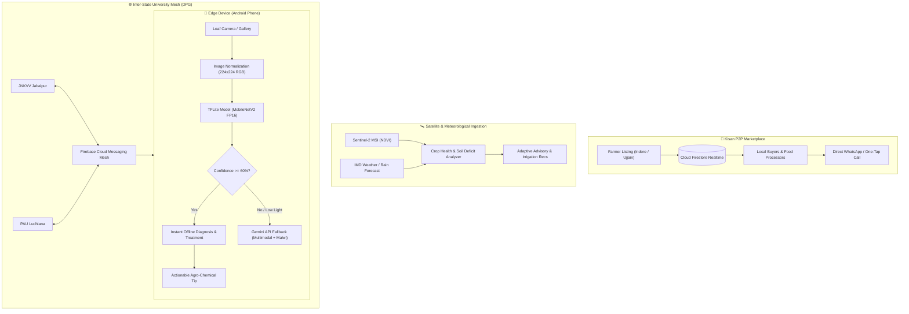

# 🌾 CropSaathi (क्रॉप साथी)
### *Smart Edge-AI & Geospatial Intelligence Mesh for Indian Farmers*

[](https://developer.android.com)
[-FF6F00?logo=tensorflow&logoColor=white)](https://www.tensorflow.org/lite)
[](https://firebase.google.com)
[](https://ai.google.dev)
[](#dpg-mesh-architecture)

---

## 📌 Executive Summary & Pitch

In Central India (Madhya Pradesh, Malwa Plateau, and surrounding agricultural belts), smallholder farmers face severe crop yield uncertainty from sudden pest outbreaks, volatile market prices dictated by local middlemen, and unpredictable climate patterns.

**CropSaathi** transforms any standard Android smartphone into a high-precision, digital agricultural companion. By fusing **zero-latency on-device edge AI**, **Sentinel-2 multispectral satellite data (NDVI)**, **real-time peer-to-peer mandi marketplace connectivity**, and **vernacular generative AI (Hindi & regional Malwi)**, CropSaathi eliminates middlemen, cuts diagnostic turnaround from days to milliseconds, and democratizes agronomy.

---

## 🏛️ DPG Mesh Architecture

CropSaathi operates on a **Digital Public Good (DPG) Mesh Architecture**. Rather than trapping farm telemetry in isolated silos, CropSaathi federates agricultural intelligence across premier state agricultural universities (e.g., JNKVV Jabalpur & PAU Ludhiana). Outbreaks detected in one district trigger proactive federated alerts across bordering agricultural zones.



---

## 🌟 Core Features & Modules

### 1. 🍃 Precision Disease Diagnosis (Deep Focus — Priority #1)
- **On-Device Inference**: Uses a quantized **MobileNetV2** neural network trained on a curated subset of high-impact crops (Tomato, Potato, Corn) covering 10 distinct classes.
- **Offline First**: Fully operational in remote fields without cellular data or Wi-Fi.
- **Safety Confidence Threshold**: Predictions under **60% confidence** automatically trigger an `Unclear — Retake Photo` safety guidance screen with instructions on natural lighting, distance, and focus to prevent erroneous pesticide applications.
- **Vernacular Fallback**: Integrated with **Google Gemini API** to generate comprehensive multi-turn advisories in **Hindi** and **Malwi** dialect when connectivity is restored.

### 2. 🏪 Kisan P2P Marketplace (Deep Focus — Priority #1)
- **Direct Farmer-to-Buyer Trading**: Eliminates the 8–15% commission extracted by intermediaries in agricultural mandis.
- **Real-Time Synchronisation**: Powered by **Cloud Firestore** real-time snapshot listeners with instantaneous feed updates.
- **Offline Resilient**: Ships with cached/fallback sample listings across MP crops (Soybean, Wheat, Potato, Chickpea, Mustard, Garlic).
- **Direct Frictionless Contact**: Buyers can initiate immediate calls (`tel:`) or pre-formatted WhatsApp negotiations with a single tap.
- **Distance-Aware Discovery**: Displays distance from the farmer's hub (Indore default) using spherical distance calculations.

### 3. 🛰️ Seasonal Advisory & Smart Irrigation (Streamlined Focus)
- **Agro-Ecological Scheduling**: Offline seasonal matrix covering **Kharif (Monsoon)**, **Rabi (Winter)**, and **Zaid (Summer)** specific to Central India soils.
- **NDVI Vegetation Health Indicators**: Tracks canopy vigor and vegetative stress indices.
- **Seed Calculator**: Calculates accurate seed tonnage requirements (kg/acre) and row-to-row spacing for regional varieties (Soybean JS-9560, Wheat GW-322, Desi Chana, Mustard).
- **Water Deficit Irrigation**: FAO-56 Penman-Monteith Evapotranspiration ($ET_0$) calculation using soil moisture, temperature, and crop growth stage.

### 4. 🗣️ Vernacular AI Assistant & Voice
- Regional dialect integration supporting **Hindi** and **Malwi**.
- Context-aware chatbot trained on regional agronomy, fertilizer dosage, and pest lifecycles.

---

## 🛠️ Technology Stack

| Layer | Technologies |
| :--- | :--- |
| **Android Client** | Kotlin, Jetpack Compose, Material 3, Coroutines, StateFlow, Room Database, DataStore |
| **Edge Machine Learning** | TensorFlow Lite (FP16 Quantized), MobileNetV2, Pillow, NumPy |
| **Cloud Services** | Firebase Firestore, Firebase Cloud Messaging (FCM), Google Gemini API |
| **APIs & Telemetry** | Sentinel-2 (Copernicus NDVI), IMD OpenWeatherMap, Retrofit 2, Moshi |
| **Build & Tooling** | Gradle Kotlin DSL (`build.gradle.kts`), ProGuard / R8 Optimization |

---

## 🧠 Machine Learning Training Pipeline

The disease diagnosis model is trained using a specialized two-phase transfer learning regimen designed for mobile hardware:

1. **Phase 1 (Feature Extractor Frozen)**: MobileNetV2 base pretrained on ImageNet is frozen. A custom classification head with Batch Normalization, Dropout (0.4 & 0.3), and Dense layers is trained with Adam ($LR = 10^{-3}$).
2. **Phase 2 (Fine-Tuning)**: The top 30 layers of MobileNetV2 are unfrozen and trained at a delicate learning rate ($LR = 10^{-5}$) to specialize on leaf pathology without catastrophic forgetting.
3. **Quantization**: Converted via TFLite Converter with **FP16 post-training quantization**, shrinking the model from ~14 MB to **< 5.5 MB** with zero noticeable accuracy degradation.

> **1-Click Google Colab Notebook**:  
> Complete turnkey pipeline available at [`app/ml_pipeline/CropSaathi_Disease_Training_Colab.ipynb`](app/ml_pipeline/CropSaathi_Disease_Training_Colab.ipynb).

### Target Classes (10 Distinct Categories)
- **Corn**: Common Rust (`Corn_Common_Rust`), Northern Leaf Blight (`Corn_Northern_Leaf_Blight`), Healthy (`Corn_Healthy`)
- **Potato**: Early Blight (`Potato_Early_Blight`), Late Blight (`Potato_Late_Blight`), Healthy (`Potato_Healthy`)
- **Tomato**: Early Blight (`Tomato_Early_Blight`), Late Blight (`Tomato_Late_Blight`), Leaf Mold (`Tomato_Leaf_Mold`), Healthy (`Tomato_Healthy`)

---

## 🚀 Setup & Execution Guide

### Prerequisites
- **Android Studio** (Ladybug / Koala or newer)
- **JDK 17** (configured as Gradle JDK)
- **Android Device or Emulator** running API 26+ (Android 8.0+)

### Step-by-Step Instructions

1. **Clone the Repository**:
   ```bash
   git clone https://github.com/aman27534/CropSathi.git
   cd CropSathi
   ```

2. **Environment Configuration**:
   Copy `.env.example` to `.env` in the project root:
   ```bash
   cp .env.example .env
   ```
   Add your Gemini API Key in `.env`:
   ```properties
   GEMINI_API_KEY=your_actual_gemini_api_key_here
   ```

3. **Open in Android Studio**:
   - Select **Open** and point to the `cropsaathi` root folder.
   - Wait for Gradle sync to index dependencies.

4. **Run on Device / Emulator**:
   - Connect your Android device or start an AVD emulator.
   - Click the green **Run (▶)** button or press `Shift + F10`.

---

## 🎬 Hackathon Judging Walkthrough Script

### Scenario A: Offline Edge Leaf Diagnosis
1. Switch phone to **Airplane Mode** (zero internet).
2. Open **CropSaathi** and navigate to the **Diagnosis** tab.
3. Tap **Upload Leaf Photo** and select an image showing Tomato Early Blight or Potato Late Blight.
4. **Result**: The app returns the diagnosis in under 50ms with an alert-colored badge, severity meter, and immediate local chemical/organic treatment tips.

### Scenario B: Direct Kisan P2P Marketplace
1. Navigate to the **Market** tab.
2. Tap the `+` Floating Action Button to list 500 kg of Wheat at ₹24/kg from Indore.
3. Tap **Post Listing**.
4. The listing immediately appears in the real-time feed with a direct call and WhatsApp contact link for buyers.

### Scenario C: Adaptive Seasonal Advisory
1. Open the **Advisory** tab.
2. The system detects the current agricultural calendar (e.g., Kharif / Rabi) and displays soil moisture recommendations, planting calendars, and weed management strategies.

---

## 📄 License & Attribution

Developed with pride for the Indian Farming Community as a Digital Public Good.  
Licensed under the [MIT License](LICENSE).
